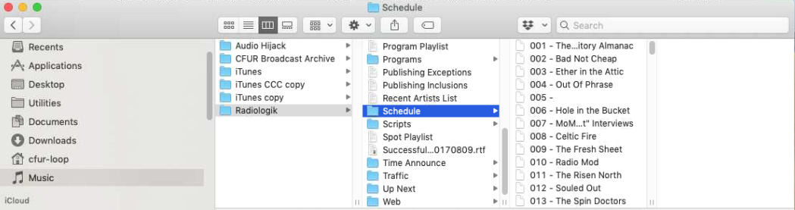
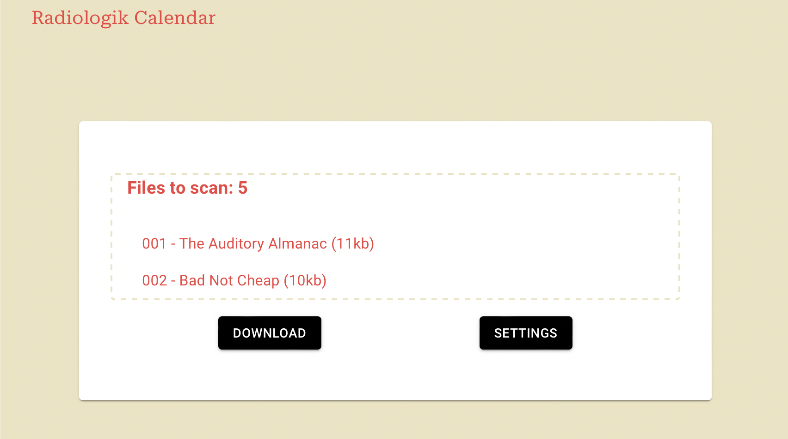
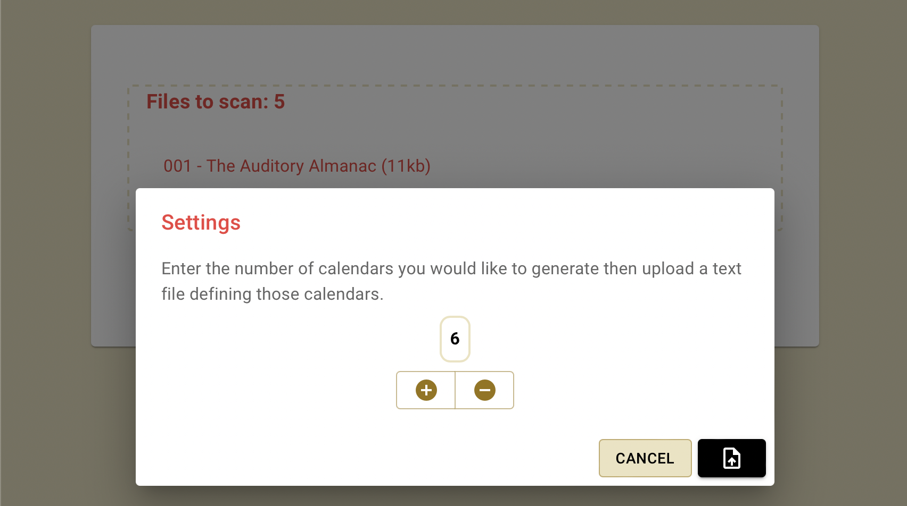

# Radiologik Calendar
Radiologik Scheduler is the companion app to Radiologik DJ. It schedules to a DJ's program queue using iTunes/Music playlists to allow a 24/7 fully-automated station. This is a web application used to convert Radiologik Scheduler files into calendars following the .ical (RFC 5545) format. 

## Usage

### Radiologik Files
This application uses one or more Radiologik Scheduler files to generate calendars, a directory of these files typically can be found in the following location: 

~/Music/Radiologik/Schedule/
<p align="center">
    
</p>

### Input File
Input files will typically have the following structure:
    
    Radiologik Schedule Segment
    _M_____/_______/____T__/_______E    
    60                                  
    Default
    ProgramTo=2
    34/38/44/4                          
    0

    Always
    Never
    ProgramCopyPath=nopath
    ColorLabel=187,136,204
    0
    False
    Display=True
    PlayRotatediniTunes=False
    Notes=
    PrePostAppleScripts=	
    AlbumSeparation=0
    SilenceSensorProfile=
    Enabled=True
    RotationType=0
    LastLog=<cr>----------- Programming Segment "Ether in the Attic" (Start time: 5:00 PM Length: 60 mins) started on Jun 6, 2022 at 4:40:02 PM
    ...

#### Notable elements
* \_M\_\_\_\_\_/\_\_\_\_\_\_\_/__\_\_T_\_/\_\_\_\_\_\_\_E

  This displays the days of the week that a segment will be ran with each day seperated by a '/ '.   
  Each day is either represented with a letter or an underscore (denoting that there is no segment that day).  
  For example '\_M\_\_\_\_\_/\_\_\_\_\_\_\_/__\_\_T_\_/\_\_\_\_\_\_\_E' means that this segment will be played  
  every Monday and Thursday (E doesn't stand for anything in our case).
        
        File               Day
        representation
        S______            Sunday
        _M_____            Monday
        __T____            Tuesday
        ___W___            Wednesday
        ____T__            Thursday
        _____F_            Friday
        ______S            Saturday
        

* 60 

  This is the duration of the segment in minutes.
* 34/38/44/4

  These numbers denote the start time of the segment corresponding to the days found in the above.  
  To get the 24H represention of these times you must divide the value by 2. For example 34 will   
  correspond to the ' \_M\_\_\_\_\_/ ', so this segment will play at 5PM on a Monday. 
* Programming Segment "Ether in the Attic"

  This last portion of notable content displays the segment name, start time and length.

### Single Calendar Mode
In single calendar mode input files are compiled into one large calendar. This is the default mode and will be ran if  
you don't enter the settings to activate multi-calendar mode.

#### Steps for calendar creation
- Drag and drop Radiologik Scheduler files into the dotted area 
- Hit download and wait for the prompt to download the file.
<p align="center">
    
</p>
### Multi-Calendar Mode
Multi-calendar mode requires another type of input file used to define each calendar block that you would like to create.  
Below is how the file should be structured: 
        
    Calendar Block Name
    event name,longer event name,another event name,wow so many events
    Another calendar block 
    Very cool event
    Empty calendar block
    ~
    ...

- Every odd line of the file must be the name of the calendar block
- Every even line of the file must be a collection of events cotained in the above calendar block 
- Events <strong>MUST</strong> be seperated by commas
- Be sure to avoid creating a new line (hitting enter) when writing event names, events should all be on one line

Below is an example of the correct way to format this input file:


```
Music Blocks
CFUR Archives,The Fresh Sheet,Radio Mod,Air Guitar Archives,Revolution Rock,Celtic Fire,Ether In the Attic,Bad Not Cheap,Hole in the Bucket
News Block
BBC World Service,The Morning Show,Democracy Now,The Northern Exchange
Special Programming Block
~
Spoken Word Block
Talking Radical Radio,CANADALAND
```
#### Steps for calendar creation
Once you have your Radiologik Scheduler files along with the text file defining calendar blocks you're  
ready to create some calendars.
- Drag and drop Radiologik Scheduler files into the dotted area 
- Select the settings tab and input the number of calendars you would like to create then hit the upload button
<p align="center">
    
</p>
<ul>
    <li>
        This will then prompt you for a file, this is where you upload the new text file that defines your calendar blocks
    <li>
        Make sure the number you inputted matches the number of calendars defined in the input file otherwise the program will default to single calendar mode
    <li>
        After uploading the text file you can hit download and individually download your new calendar files
</ul>


## References
- [Radiologik DJ/Scheduler Help](https://macinmind.com/Help/Radiologik/)
- [iCalendar.org](https://icalendar.org/)
- [iCalendar Validator](https://icalendar.org/validator.html)
- [RFC 5545](https://datatracker.ietf.org/doc/html/rfc5545)